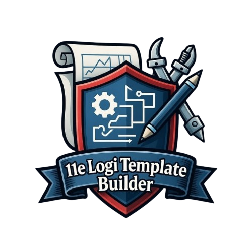

# 11eRC-FL Template Builder

<p align="center">
  
</p>

[](https://github.com/NapoSky/11eLogiTemplateBuilder/actions/workflows/deploy.yml)
[](https://github.com/NapoSky/11eLogiTemplateBuilder/actions/workflows/test.yml)
[](https://creativecommons.org/licenses/by-nc/4.0/)

A stockpile template generator for the game Foxhole, designed for the 11eRC-FL regiment.

## 🎯 Features

- **Modern UI**: TypeScript application with Tailwind CSS
- **Drag & drop**: Easily organise icons into sections
- **Smart grid**: Precise CSS grid icon placement
- **Automatic categorisation**: Icons sorted by type (Weapons, Ammunition, Uniforms, etc.)
- **Adjustable size**: Change the global icon size (S/M/L)
- **Quantity management**: Click to edit the quantity of each item
- **PNG export**: High-quality 1920×1080 image ready to use
- **JSON save**: Save and reload your templates
- **Keyboard shortcuts**: Quick navigation with Ctrl+S, Ctrl+O, Ctrl+E
- **Help menu**: `?` button to view all shortcuts

## 🚀 Usage

### Quick start

```bash
# Install dependencies
npm install

# Start the development server
npm run dev

# Production build
npm run build
```

### Workflow

1. **Double-click** the canvas to create a new section
2. **Search** or browse icons in the left sidebar
3. **Drag & drop** icons into a section
4. **Reorder** icons by dragging them within the grid
5. **Click** an icon to edit its quantity
6. **Export** as PNG or save as JSON

## ⌨️ Keyboard shortcuts

| Shortcut | Action |
|----------|--------|
| `Ctrl + S` | Save template (JSON) |
| `Ctrl + O` | Load template |
| `Ctrl + E` | Export as PNG |
| `?` | Show/hide help |
| `Escape` | Close modals |

## 🖱️ Mouse actions

- **Double-click** the canvas → Create a new section
- **Drag** an icon from the sidebar → Add to a section
- **Drag** an icon in the grid → Reorder
- **Click** a placed icon → Edit quantity/subtype
- **Drag** a section header → Move the section
- **Drag** a section corner → Resize

## 📐 Icon size

Use the **S** / **M** / **L** buttons in the toolbar to adjust the global icon size:
- **S** (Small): Compact icons for more content
- **M** (Medium): Default balanced size  
- **L** (Large): Larger, more visible icons

## 📁 Project structure

```
11eTemplateBuilder/
├── src/
│   ├── main.ts              # Entry point
│   ├── store.ts             # Global state (sections, icons)
│   ├── types.ts             # TypeScript types
│   ├── styles.css           # Tailwind styles
│   └── components/
│       ├── Toolbar.ts       # Toolbar + shortcuts
│       ├── Sidebar.ts       # Icon list
│       ├── Canvas.ts        # Work area
│       ├── Section.ts       # Section component
│       └── ...
├── assets/
│   ├── backgrounds/         # Template backgrounds (PNG)
│   ├── emojis/              # Icons for Todolists
│   └── icons/               # Foxhole icons (PNG)
├── data/
│   ├── iconMapping.json     # Icon display names
│   └── categoryMapping.json # Icon categorisation
├── index.html
├── package.json
├── tsconfig.json
└── vite.config.ts
```

## 💾 Export formats

| Format | Use |
|--------|-----|
| **PNG** | 1920×1080 image for Discord/forum sharing |


## 🛠️ Tech stack

- **TypeScript**: Static typing
- **Vite**: Fast build and HMR
- **Tailwind CSS v4**: Utility-first styles
- **interact.js**: Section drag & resize
- **html2canvas-pro**: PNG export (oklab/oklch support)

## 🌐 Compatibility

- ✅ Chrome 90+
- ✅ Firefox 90+
- ✅ Safari 15+
- ✅ Edge 90+

## 🎮 About Foxhole

Foxhole is an MMO war game developed by Siegecamp Inc. This template builder is a community tool created to help manage regiment logistics.

## 📜 License

This project is released under **CC BY-NC 4.0** (Creative Commons Attribution - NonCommercial).

> ⚠️ **Important note**: Foxhole icons and graphical assets are the property of **Siegecamp Inc.** and are used solely for non-commercial community purposes.

See the [LICENSE](LICENSE) file for details.

---

**v2.0** - Made with ❤️ for the 11eRC-FL
